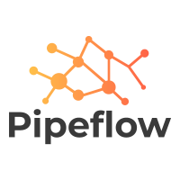
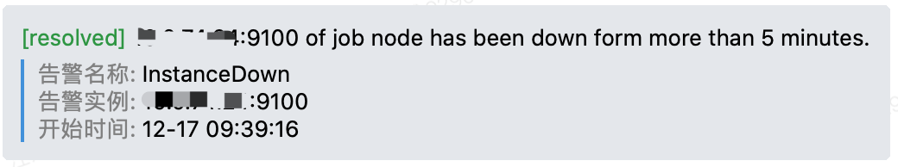
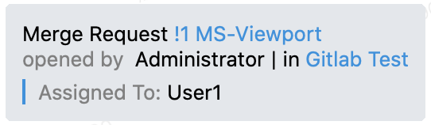
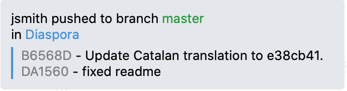

# Pipeflow



该项目主要用于使用Webhook的方式接收来源系统（Source）的数据，并转换为目标系统（Target）的格式，并推送到目标系统。

## Screenshots

### AlertManager 告警数据


### Gitlab WebHook 数据
#### Merge Request


#### Push


## Features

- [x] 支持AlertManager系统
- [x] 支持Gitlab系统
  - [x] MergeRequest事件
  - [x] Push事件
  - [x] Comment事件
- [x] 支持Azure DevOps系统
  - [x] WorkItem
    - [x] Create
    - [x] Update
    - [x] Comment
  - [x] Build Completed
  - [x] Release
    - [x] Start
    - [x] Completed


## Installation

```shell
go get -u github.com/gin-gonic/gin
```

## Quick Start

```shell
go run main.go
```

## API

|Path|Method|Parameters|Description|
|---|---|---|---|
|/bots|GET|<None>|列出所有机器人配置信息|
|/bot|POST|body: BotConfig|创建新的机器人配置|
|/bot/:id|DELETE|id: String|删除机器人配置|
|/bot/:id|POST|id: String, body: JSON|通过机器人推送消息|

### BotConfig
```json
{
	"source": "alertmanager|gitlab|devops", // 来源支持Prometheus的AlertManager、Gitlab和Azure DevOps
	"target": "wechat", // 推送消息的目标支持 企业微信的Bot
	"url": "https://qyapi.weixin.qq.com/cgi-bin/webhook/send?key=a194021e-3de1-4e74-9610-b02931afa6cc" // 推送目标的URL地址
}
```


